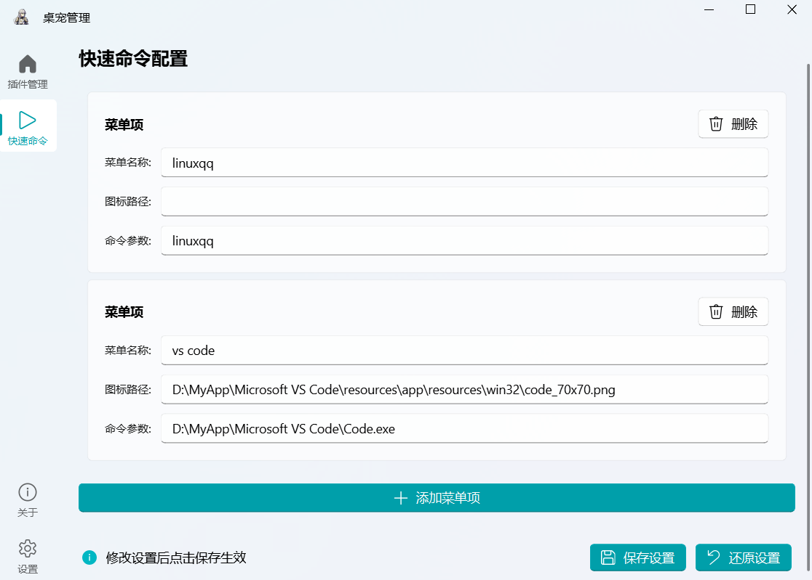

# 我的桌宠

## 📌 项目简介

> [!abstract] 我的桌宠我做主！这是一款支持插件扩展的高自由度Live2D桌宠应用，让你的桌面充满活力与个性。


## 📚 项目背景
### 1.1 项目概述
- **团队**：偶遇Python大作业，拼尽全力无法战胜，因为不会英语  
- **目标**：打造轻量级、模块化、可持续扩展的Live2D桌宠应用
- **背景**：市面上大多桌宠华而不实，大多要么太过臃肿要么就只是个花瓶
### 1.2 开发原因
- ~~苦于Python大作业选题的大学生，苦思无果后瞎选的课题~~
- ~~想开发一个真正有用的桌宠（大概有用吧）~~
- 基于Python课程实践需求的创新尝试
- 探索开发真正具备实用价值的桌面交互工具
### 技术栈

>[!caution]- 本项目为Python学习实践项目（边敲边学），对Python理解不足，代码~~肯定~~可能存在优化空间，大佬轻喷，欢迎技术交流与改进建议！

[PySide6](https://doc.qt.io/qtforpython-6/)
[live2d-py](https://github.com/Arkueid/live2d-py)

---

## 🚀 功能特性及开发进度

| 功能     | 状态   | 说明                            |
| ------ | ---- | ----------------------------- |
| ✅ 基础展示 | 已实 现 | 支持Live2D模型加载与基本交互             |
| ✅ 插件系统 | 开发中  | 模块化架构设计，支持第三方功能扩展（如天气插件/日程提醒） |


### 目前开发计划

1. 实现插件系统

2. 实现预装插件

    1. 沉浸式桌宠✅

    2. 沉浸式桌宠增强（win32）✅

    3. 鼠标跟随✅

    4. 快速命令✅

    5. 倒计时✅

    6. 表情选择✅

    7. 动作选择✅

    8. 显示控制✅

       

### 功能展示

- 基础展示


- 预装插件

  1.  沉浸式桌宠

     

     插件介绍：设置窗口属性为无边框、始终置顶（背景透明： 默认为透明色，实际窗口中显示的是黑色，所以无法实现鼠标穿透）

  2. 沉浸式桌宠增强

     

     插件介绍：使用winapi设置透明颜色键实现鼠标穿透，会导致模型一些黑色（默认背景色）部分也变透明，可通过设置桌宠的背景颜色规避

  3. 鼠标跟随

     

     插件介绍：桌宠视线跟随鼠标

  4. 快速命令

     

     

     插件介绍：使用subprocess.Popen()方法，快速执行一个简单的命令,可在设置页面添加菜单项

  5. 倒计时

     

     插件介绍：添加倒计时选项，可以设置不同的倒计时时间

  6. 表情选择 && 动作选择

      

     插件介绍：live2d.SetExpression()获取表情列表，解析模型JSON文件，获取详细的动作信息

  7. 显示控制

     

     插件介绍：提供菜单选项来控制桌宠的显示和隐藏

---

## 🛠 安装与依赖
### 系统要求

| 系统         | 开发状态 |
| ---------- | ---- |
| Windows 11 | ✅    |
| archlinux  | ✅    |
| 其他         | ❓    |

### 安装步骤
1. 克隆仓库：
```bash
   git clone https://github.com/not-linyi/MyDeskPetCore
   cd MyDeskPetCore
```
2. 安装依赖（建议使用虚拟环境）：
```bash
   python -m venv 
   source venv/bin/activate # Windows: .\.venv\Scripts\activate
   pip install -r requirements.txt
```
3. 构建/运行：
```bash
   python DeskPet.py
```

---

## 🧪 快速开始

>[!todo] 待开发

---

## 📎 已知BUG

| 编号      | 描述                | 严重性          | 状态    |
| ------- | ----------------- | ------------ | ----- |
| BUG-001 | live2d模型有残影       | Major        | ✅已修复  |
| BUG-002 | linux下配置目录解析失败    | **Critical** | ✅已修复  |
| BUG-003 | 主界面最小化后，无法直接用桌宠唤出 | Minor        | ❓部分修复 |
| BUG-004 | 桌宠在wayland环境下无法拖动 | Minor        | ❌待修复  |

> [!bug] 更多详细BUG信息请查看 [Wiki 的 "已知BUG" 页面](https://github.com/not-linyi/MyDeskPetCore/wiki#1-bug%E5%88%97%E8%A1%A8)
---

## 📚 文档与资源
- **开发者文档及用户文档**：[Wiki](https://github.com/not-linyi/MyDeskPetCore/wiki)
- **插件获取**：暂无~~你也可以开发~~

---

## 📎 许可证
本项目采用 [GPLv3](./LICENSE)，欢迎自由使用和修改。
